# Findings Report

## Executive Summary

This assessment identified multiple common web application security weaknesses within OWASP Juice Shop through controlled testing performed in a local Docker lab environment.
Testing activities focused on reconnaissance, request interception, authentication testing, input manipulation, and vulnerability validation using OWASP ZAP and browser developer tools.
Several vulnerabilities were successfully identified and validated, demonstrating how insecure input handling, insufficient access controls, and improper application security practices may expose web applications to unauthorised access and information disclosure risks.
All testing was conducted within an isolated lab environment for educational and security training purposes.

---

## Scope & Test Environment

| Component | Description |
|---|---|
| Target Application | OWASP Juice Shop |
| Hosting Platform | Docker |
| Testing Platform | Kali Linux |
| Proxy Tool | OWASP ZAP |
| Browser | Firefox Developer Edition |
| Environment | Local isolated lab environment |
| Target Address | http://127.0.0.1:3000 |

---

## Assessment Summary

| Finding | Severity |
|---|---|
| SQL Injection Authentication Bypass | High |
| Insecure Direct Object Reference (IDOR) | High |
| Cross-Site Scripting (XSS) | High |
| JWT stored in browser localStorage | Medium |
| Verbose Error Handling & Information Disclosure | Medium |

 
---

# 1. Verbose Error Handling & Information Disclosure

## Severity
Medium


## Description
The application returned verbose error responses containing backend technology and database related information when processing malformed or unexpected user input.
Excessive error detail exposed internal application behaviour and implementation details that may assist attackers during reconnaissance and vulnerability discovery activities.


## Reconnaissance & Discovery
OWASP ZAP Active Scan analysis against search functionality, identified abnormal behaviour associated with the search functionality.

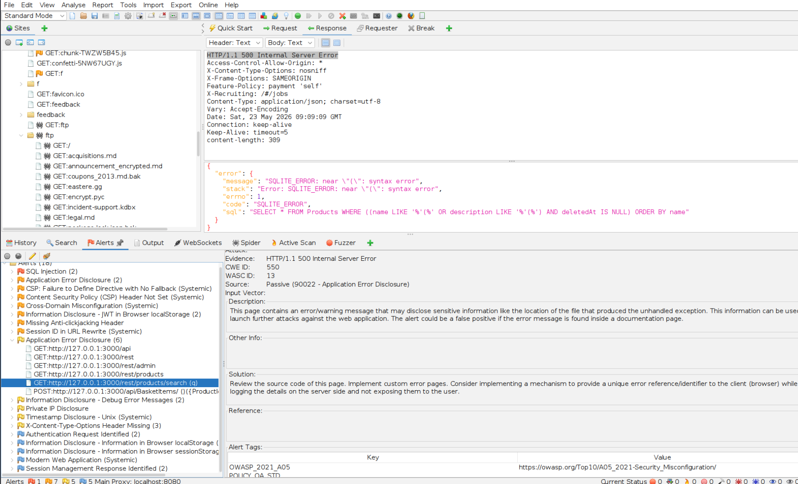

This included requests containing URL-encoded payloads such as `%27%28`, representing the characters `'(`. These responses indicated that malformed user input was interacting with backend SQL query processing and generated verbose SQLite syntax error disclosure.

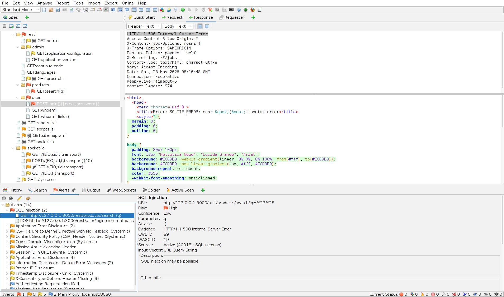

The scan and subsequent manual testing identified behaviour consistent with potential SQL Injection vulnerabilities. The application returned detailed database-related error messages instead of generic failure responses, exposing backend SQLite query information and internal application behaviour.


## Exploitation
Manual testing was performed against the application's search functionality by supplying malformed SQL-related characters such as:
```text
'(
```
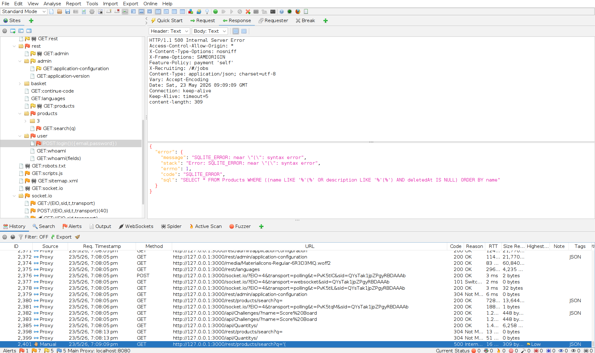

The application responded with verbose error information referencing backend SQLite database processing and query behaviour, confirming that internal implementation details were exposed to users.


## Evidence

- Verbose database related error responses returned
- SQLite technology disclosure observed
- Internal query processing behaviour exposed
- Application failed to return generic error handling responses
- Error responses assisted further vulnerability reconnaissance activities


## Impact
Verbose error handling and information disclosure vulnerabilities may assist attackers during reconnaissance and exploitation activities by exposing sensitive implementation details about the application backend.

In real-world environments, vulnerabilities of this nature may lead to:

- Increased effectiveness of targeted attacks
- Exposure of backend technologies and frameworks
- Improved attacker understanding of application structure
- Facilitation of SQL Injection and related attack techniques
- Disclosure of sensitive debugging or application behaviour information


## Remediation

- Implement generic user-facing error responses
- Avoid exposing backend database or framework details
- Log detailed errors securely server-side only
- Disable verbose debugging functionality in production environments
- Implement secure exception and error handling controls


---

# 2. SQL Injection Authentication Bypass

## Severity
High


## Description
The application failed to properly sanitise user supplied input submitted to the authentication endpoint.


## Reconnaissance & Discovery
OWASP ZAP Active Scan functionality was used during reconnaissance to identify potential vulnerabilities within the Juice Shop application.

The `/rest/user/login` endpoint generated verbose SQLite database errors when malformed input was supplied, indicating possible SQL Injection vulnerabilities within the authentication mechanism.

The application returned HTTP 500 Internal Server Error responses and exposed internal query structure information, including backend database technology and SQL statement details.

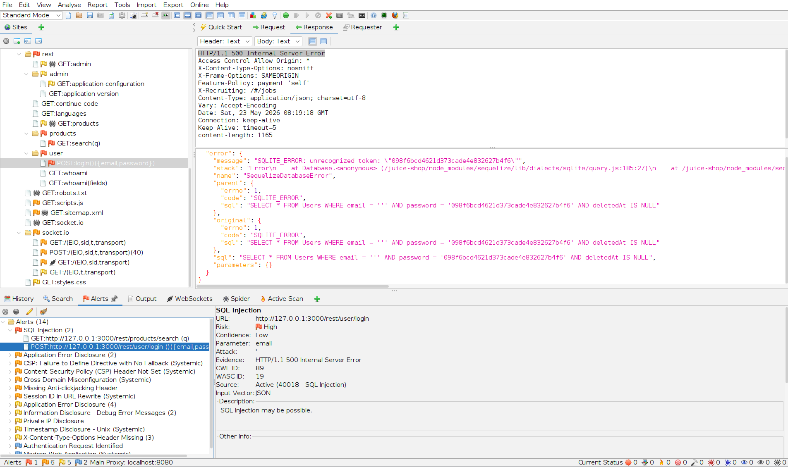

Following the scan results, fuzzing was then performed against the login functionality using specially crafted payloads. 

These payloads were supplied within the email field to observe how the application handled unexpected input and to determine whether user-controlled data was being improperly incorporated into backend SQL queries.

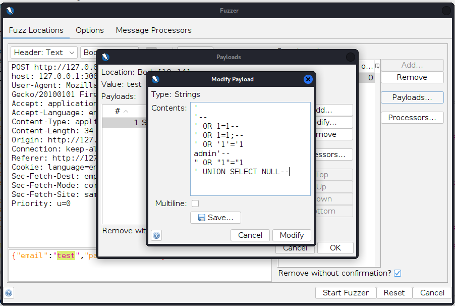

The results showed that both Both `' OR 1=1;--` and `' OR 1=1--` payloads generated HTTP `200 OK` responses, suggesting the backend SQL query logic may have been altered by the supplied input.

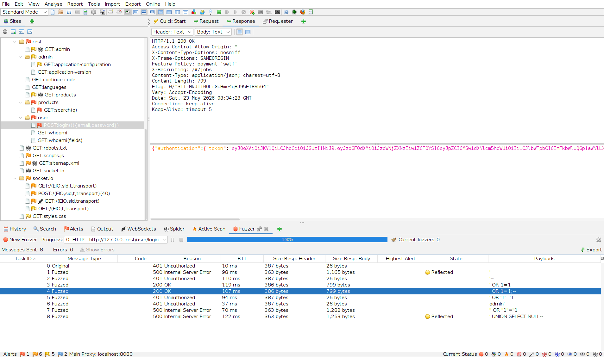


## Exploitation


Following the results obtained during fuzzing and vulnerability discovery, further testing was conducted against the login form to determine whether the identified SQL Injection behaviour could be leveraged to manipulate the authentication process.

The SQL payload was supplied within the email login field of the log in form to observe how the application responded.
```sql
' OR 1=1;--
```
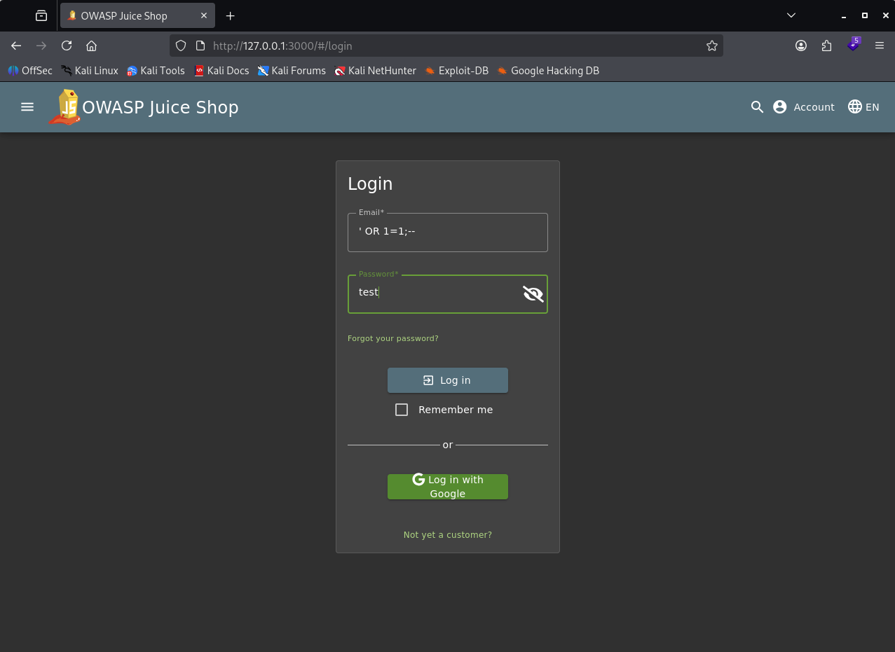

The payload manipulated the backend SQL query logic and resulted in successful authentication bypass behaviour. 

Following submission of the payload, the application authenticated the session without requiring valid credentials and granted access to the administrator account and associated application functionality.

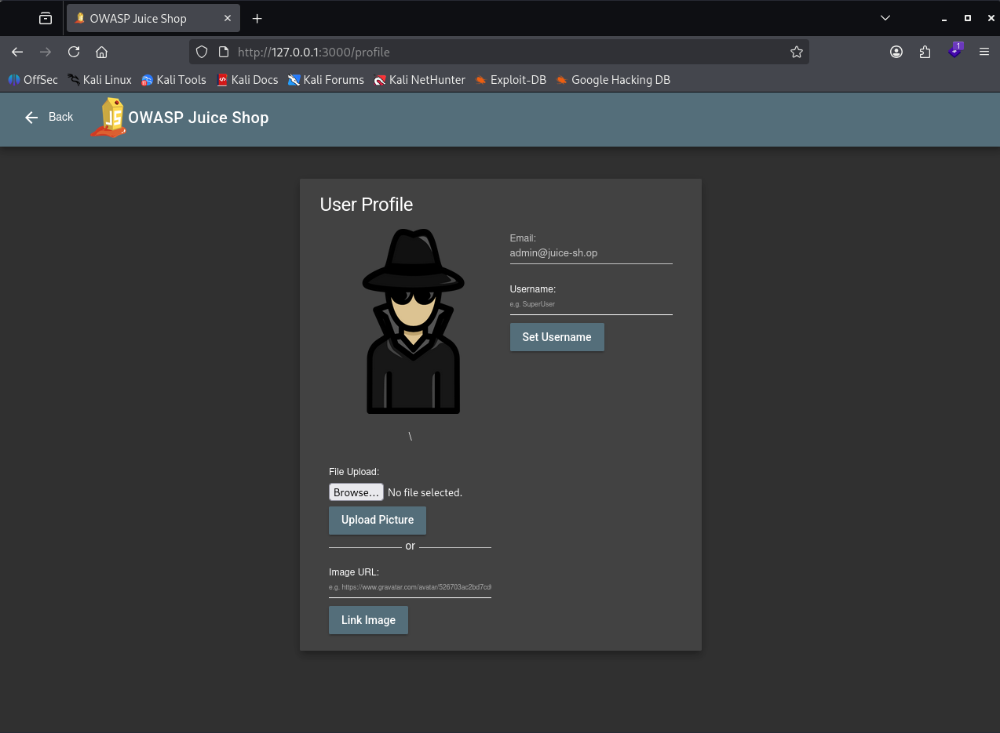

This demonstrated that user supplied input was not properly sanitised or parameterised before being processed by the backend database query.


## Evidence

- HTTP 200 response returned
- Authentication bypass observed
- Administrator account access granted
- Application authenticated without valid credentials
- Verbose database related responses observed during testing


## Impact

Successful exploitation of this vulnerability may allow an attacker to bypass authentication controls and gain unauthorised access to privileged application functionality.

In real-world environments, vulnerabilities of this nature may lead to:
- Administrative account compromise
- Sensitive information disclosure
- Data manipulation or deletion
- Privilege escalation
- Further compromise of connected systems or users


## Remediation

- Use parameterised SQL queries
- Implement server-side input validation
- Avoid dynamic SQL query construction
- Apply least privilege database permissions
- Return generic authentication failure responses


---

# 3. Insecure Direct Object Reference (IDOR)

## Severity
High


## Description

The application exposed direct object references through API requests containing predictable numeric identifiers associated with user basket functionality.
Insufficient access control validation allowed object identifiers to be modified and replayed while the application continued processing requests successfully.


## Reconnaissance & Discovery

During spidering and application mapping activities performed within OWASP ZAP, a basket-related API endpoint was discovered within the application's attack surface.

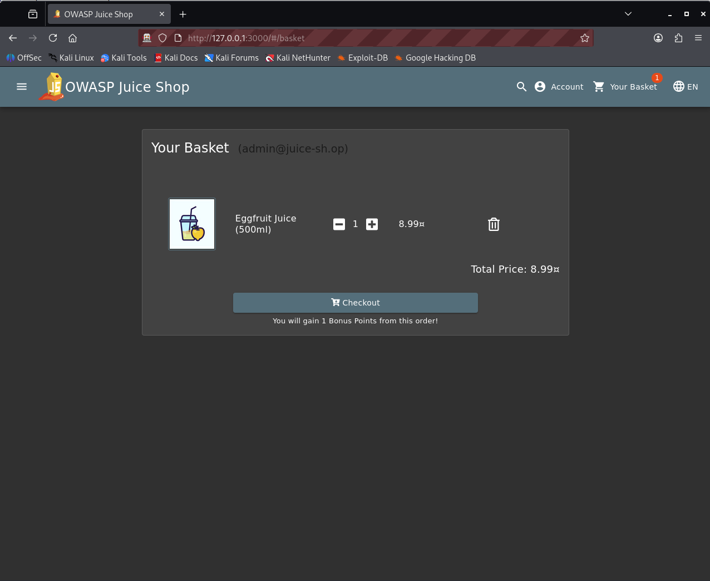

As items were added to the shopping basket and standard user actions were performed, corresponding API calls containing basket-related object references became visible within intercepted HTTP requests and responses.

The application utilised numeric object references within requests such as:

```http
GET /rest/basket/1 HTTP/1.1
```


## Exploitation

A request associated with the authenticated user's basket was intercepted using OWASP ZAP.

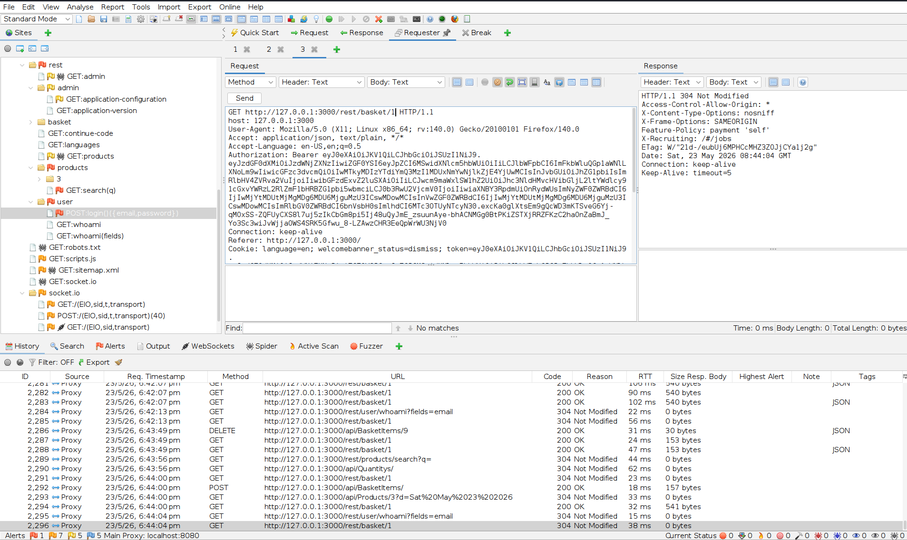

The basket identifier within the request was manually modified from:
```text
/rest/basket/1
```
to:
```text
/rest/basket/2
```

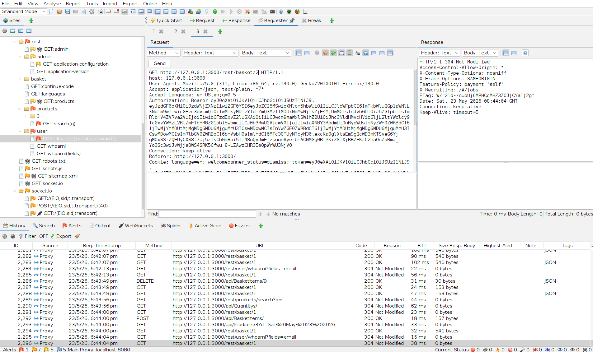

The manipulated request was replayed to the application, which returned a successful HTTP 200 response and exposed basket information associated with another user account.

This demonstrated insufficient server-side validation of object ownership and authorisation controls.

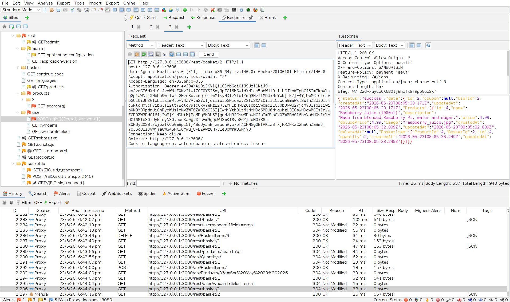


## Evidence

- HTTP 200 response returned following parameter manipulation
- Modified object identifiers were accepted by the application
- Basket contents associated with another user were exposed
- Predictable numeric identifiers observed within API requests
- Lack of access control validation confirmed through request replay


## Impact

Successful exploitation of this vulnerability may allow attackers to access, modify, or enumerate sensitive data belonging to other users.
In real-world environments, vulnerabilities of this nature may lead to:

- Unauthorised access to sensitive information
- Exposure of customer or account data
- Horizontal privilege escalation
- Data manipulation or deletion
- Large-scale enumeration of application objects

## Remediation

- Implement server-side authorisation validation for all object requests
- Verify object ownership before processing requests
- Avoid exposing predictable sequential object identifiers
- Use indirect object references or randomised identifiers where possible
- Apply least privilege access controls across API functionality


---

# 4. Cross-Site Scripting (XSS)

## Severity
High


## Description
The application failed to properly sanitise and safely render user supplied input before displaying content within the browser.
This allowed malicious JavaScript payloads to execute within the client-side application context, demonstrating Cross-Site Scripting (XSS) behaviour.


## Reconnaissance & Discovery
During reconnaissance and manual application testing, OWASP ZAP active scanning identified that the Content-Security-Policy (CSP) HTTP security header was not set by the application. The absence of CSP protections increases the potential impact of Cross-Site Scripting (XSS) vulnerabilities, as browsers are not instructed to restrict the execution of untrusted or malicious client-side scripts.

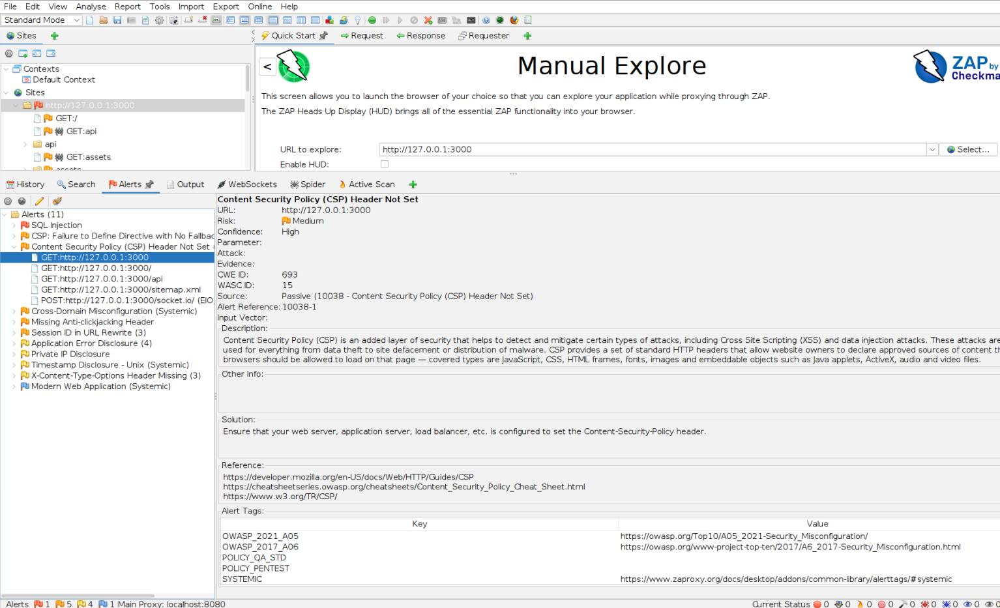

Testing focused on determining whether user-controlled data was appropriately sanitised, validated, encoded, and securely rendered before being processed by backend functionality, inserted into the DOM, or reflected back to users within application responses.


## Exploitation
Controlled XSS payloads were submitted into application input fields and URL parameters to assess whether malicious client-side script execution could be achieved.

Example payloads used during testing included:

and

```html
<script>alert('XSS')</script>
```
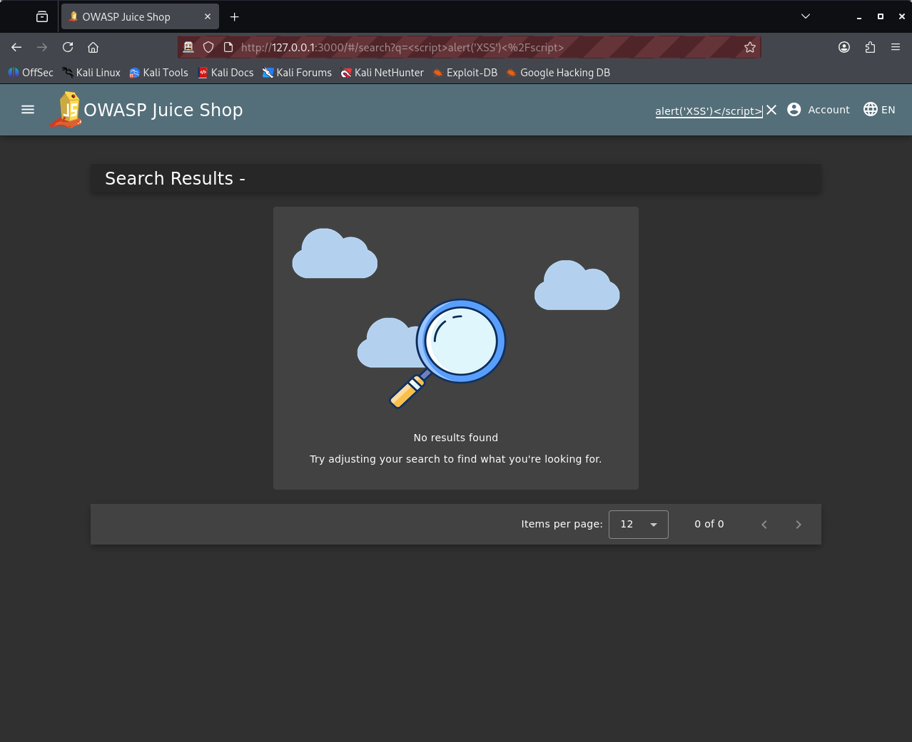

The script was not successfully executed in this attempt. 

The following payload was then submitted to test the search field:

```html

```

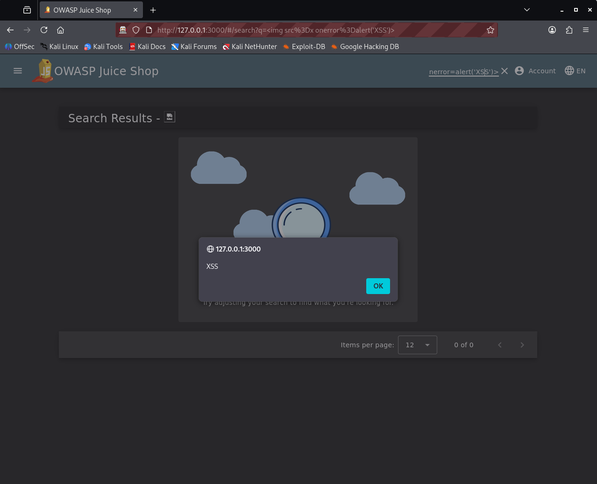

The application processed and rendered the malicious input without properly sanitising the payload, resulting in successful JavaScript execution within the browser.


## Evidence

- User supplied input rendered without sufficient sanitisation
- Malicious JavaScript executed within the browser
- Browser alert execution successfully triggered
- Unsafe handling of user controlled content observed
- Client-side rendering behaviour contributed to exploitation

The successful execution of the `` payload within the search functionality, while the direct `<script>` payload failed to execute, suggests that the vulnerability is likely occurring through unsafe client-side DOM rendering behaviour rather than traditional server-side reflected XSS processing.


## Impact

Successful exploitation of XSS vulnerabilities may allow attackers to execute arbitrary JavaScript within a victim user's browser session.

In real-world environments, vulnerabilities of this nature may lead to:

- Session hijacking
- Credential theft
- Malicious redirection
- Defacement of web content
- Client-side malware delivery
- Theft of authentication tokens or sensitive browser data


## Remediation

- Implement proper output encoding and escaping
- Sanitise user supplied input before rendering content
- Avoid unsafe DOM manipulation methods
- Implement Content Security Policy (CSP) protections
- Use secure framework rendering features where possible
- Validate and filter potentially dangerous input


---


# 5. Insecure JWT Storage

## Severity
Medium

## Description

The application was observed storing and processing JSON Web Tokens (JWTs) within localStorage in the client-side browser during authenticated sessions.
JWTs stored within browser-accessible storage locations, may become accessible to malicious client-side scripts in the event of a Cross-Site Scripting (XSS) vulnerability or other browser-based attacks. This behaviour increases the risk of session token theft and authenticated session compromise.


## Reconnaissance & Discovery

During testing and browser storage analysis using OWASP ZAP and browser developer tools, authenticated application behaviour was reviewed to determine how session state and authentication tokens were managed client-side.

An active scan using ZAP identified that JWT authentication tokens were stored within browser Local Storage following successful authentication.

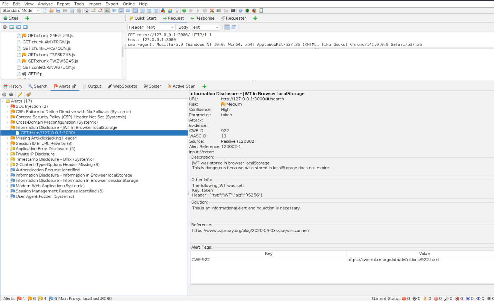


## Exploitation

A test account was created to utilise authenticated access for testing.

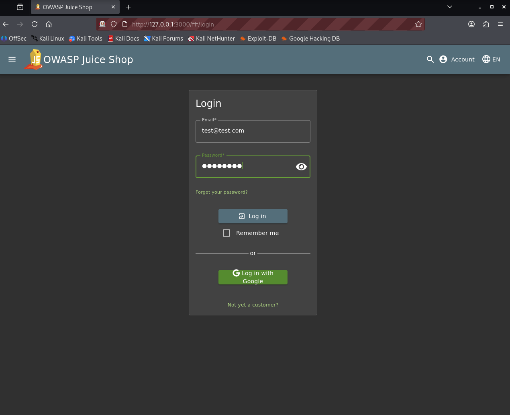

Following authentication, browser developer tools were used to inspect Local Storage entries associated with the Juice Shop application.

Testing confirmed that JWT authentication tokens were accessible directly through browser-exposed client-side storage mechanisms. The token contents could be viewed, copied, decoded, and reused within authenticated requests.

Exploitation identified that authentication tokens were not protected using the `HttpOnly` cookie attribute. Also, given the application was accessed over an unencrypted HTTP connection during testing, secure cookie protections such as the `Secure` attribute were also not observed, increasing the potential exposure of authenticated session data during transmission.

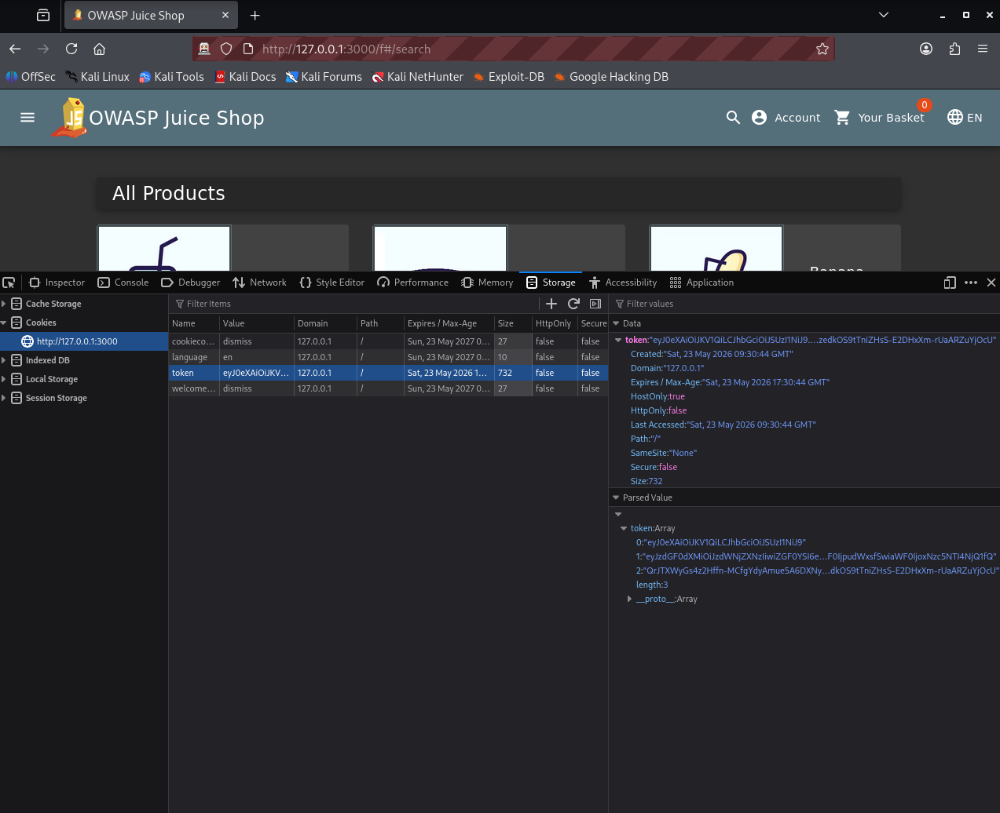

The JWT could successfully be copied from the browser Developer Tools Console

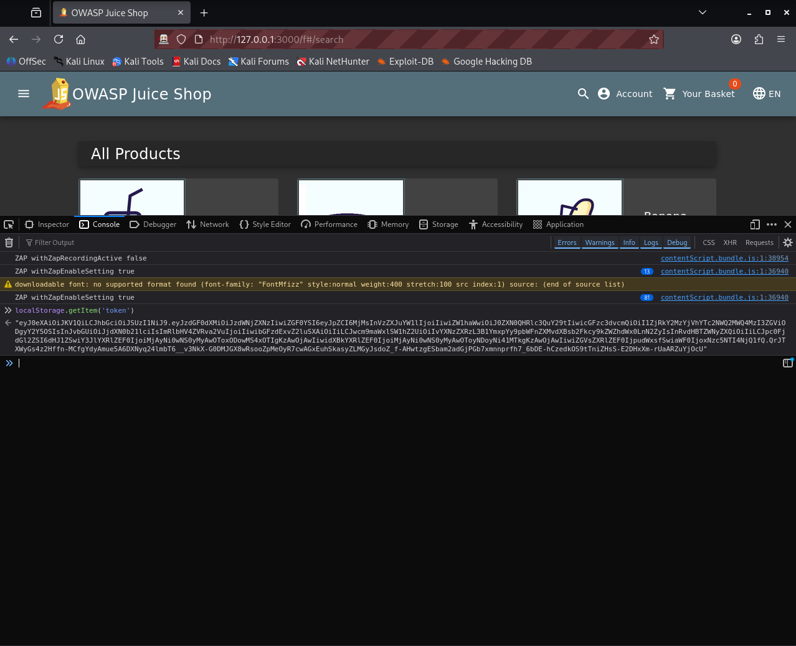

The extracted JWT was then successfully pasted into the `Authorization: Bearer` header of the intercepted GET request. 

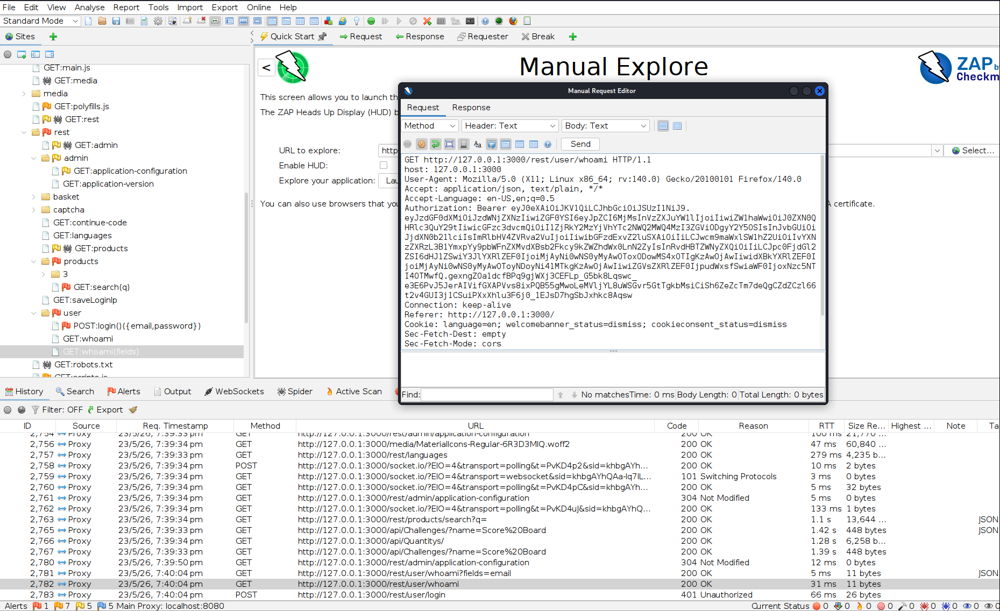

The application returned an HTTP `200 OK` response, demonstrating that authenticated functionality relied upon the supplied bearer token for request authorisation.

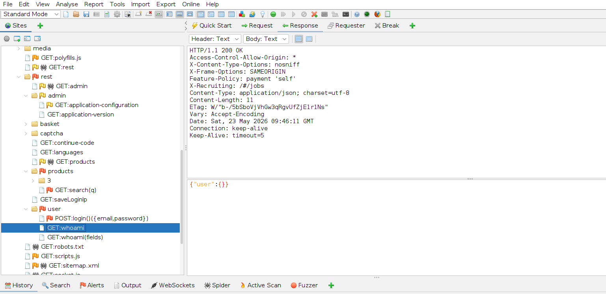

This behaviour demonstrated that authenticated session tokens may become vulnerable to theft or misuse if malicious client-side script execution were achieved through vulnerabilities such as Cross-Site Scripting (XSS).


## Evidence

- JWT authentication tokens stored within browser Local Storage
- Tokens accessible through browser developer tools
- JWT contents viewable and decodable client-side
- Authenticated requests relied upon bearer token validation
- Sensitive authentication material exposed to browser-side script access


## Impact

Successful theft or misuse of JWT authentication tokens may allow attackers to impersonate authenticated users and perform actions within the application under the victim's session context.

In real-world environments, vulnerabilities of this nature may lead to:

- Session hijacking
- Account compromise
- Unauthorised access to authenticated functionality
- Persistence of stolen authenticated sessions
- Abuse of privileged user accounts
- Increased impact of Cross-Site Scripting vulnerabilities


## Remediation

- Avoid storing sensitive authentication tokens within Local Storage
- Prefer secure, HTTPOnly, and SameSite-protected cookies for session management
- Implement short JWT expiration periods
- Apply token rotation and revocation mechanisms
- Implement strong Content Security Policy (CSP) protections
- Reduce exposure to client-side script injection vulnerabilities


---


