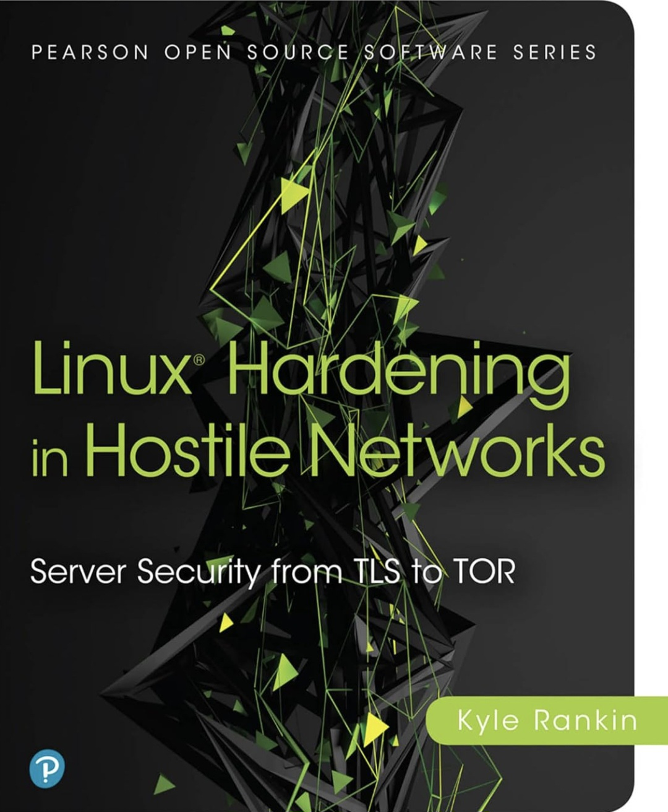

# Linux Hardening in Hostile Networks

**Author:** Kyle Rankin

  

---

## Overview

This book provided practical knowledge of system hardening and defending against threats of varying levels of sophistication.

Different Linux tools and browser extensions were explored throughout this text.

### My Review

This book helped strengthen my understanding of core security concepts such as least privilege, service exposure, secure remote administration, authentication controls, and defence in depth.

I also learned about preservation of anonymity techniques and tools and how they work to
protect user identity.

---

## Key Concepts Applied

* Server security
* Workstation security
* Network security
* Web servers
* DNS
* Databases
* Incident Response
* Password security
* Digital Privacy
* TOR and Tails
* TLS and HTTPS

---

## Related Projects

- [SSH Key-Based Authentication](../../projects/secure/ssh-key-authentication/README.md)

- [Nmap Scanning and Brute Force Attack](../../projects/break/nmap-scanning/README.md)

---