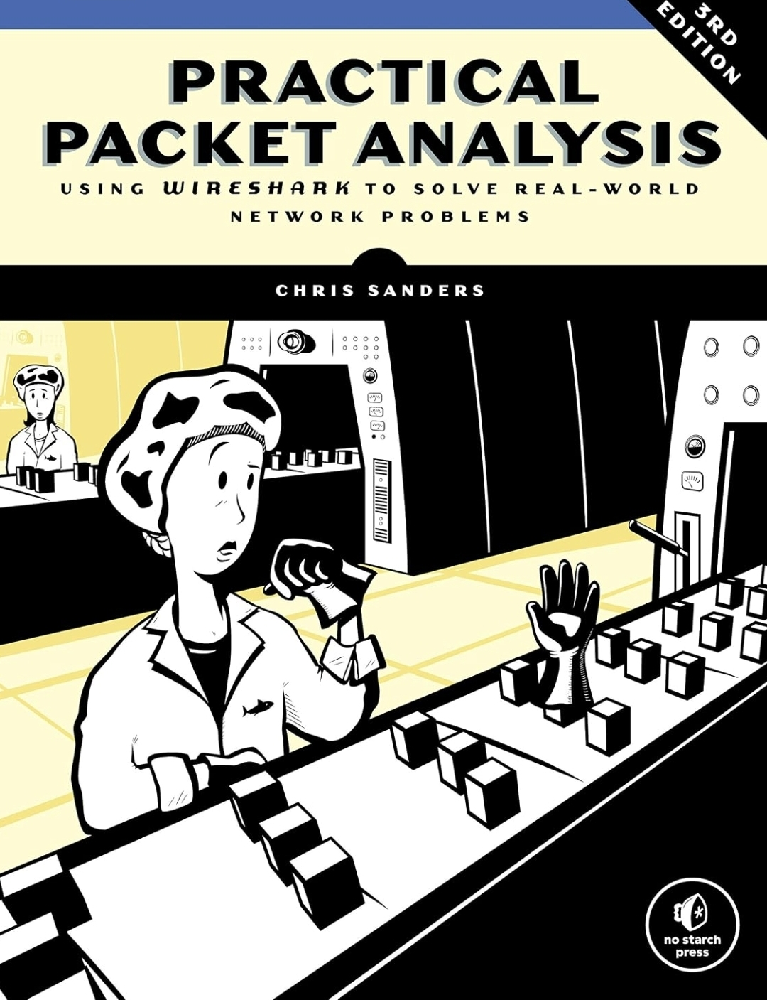

# Practical Packet Analysis, 3rd Edition

**Author:** Chris Sanders

  

---

## Overview

This book provided a practical introduction to packet analysis using Wireshark, covering the process of capturing, filtering, and analysing network traffic to better 
understand communication between systems.

### My Review

I picked up *Practical Packet Analysis, 3rd Edition* because I found Wireshark overwhelming to look at and wanted to learn to efficiently navigate packet captures, 
apply filters, follow conversations, and begin making sense of what was happening across a network.

Being able to inspect individual packets and see protocols operating in practice gave me a much stronger understanding of how devices 
communicate across a network.

I particularly liked how the book introduced packet analysis from a security perspective, demonstrating how unusual or malicious network behaviour can be identified 
through traffic analysis.

---

## Key Concepts Applied

* Wireshark
* Packet capture and analysis
* Capture and display filters
* TCP/IP and network protocols
* Packet and protocol inspection
* TCP stream analysis
* Network traffic analysis
* Network troubleshooting
* Traffic baselining
* Suspicious traffic identification

---

## Related Projects

Packet Filter focused project to come...

Tangentially related projects:

- [VNC over SSH](../../projects/secure/vnc-over-ssh/README.md)
- [pi-hole-dns](../../projects/build/pi-hole-dns/README.md) 

---

