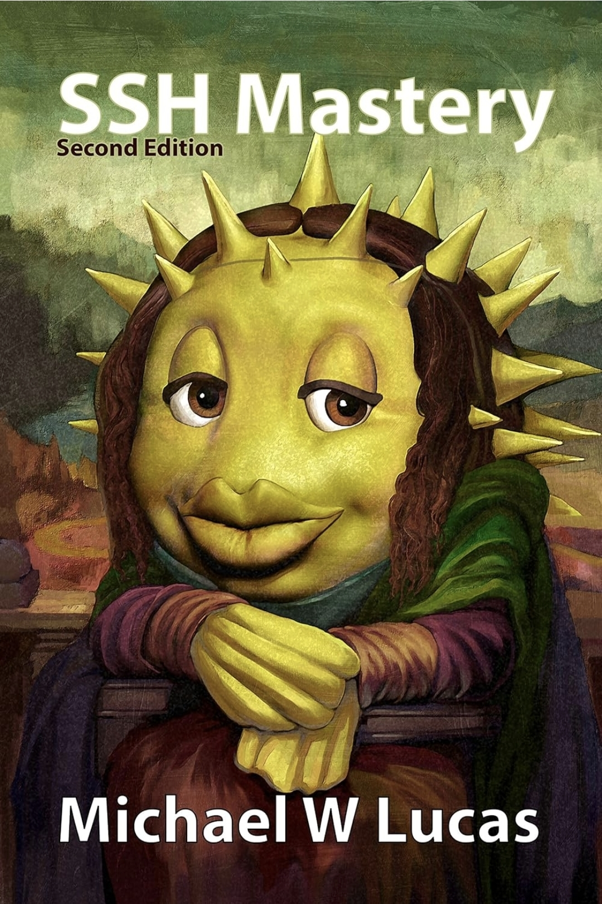

# SSH Mastery - Second Edition

**Author:**  Michael W. Lucas

  

---
## Overview

This book provided foundational knowledge into Secure Shell (SSH), secure remote administration, authentication mechanisms, key-based authentication, and encrypted remote communication. 
Concepts explored throughout the book directly supported the development of the SSH Key-Based Authentication project, including the implementation of ED25519 key pairs, hardened remote access practices, SSH configuration management, and secure administrative access between systems within the homelab environment.

### My Review

I especially appreciated Lucas’ ability to explain technical concepts through memorable analogies and his recurring references to the Seven Deadly Sins in this piece were enjoyable and more thought-provoking than the generic examples commonly found throughout many technical texts. I am a big fan of Michael W. Lucas's work and naturally the cover art adds to that appreciation.

---
## Key Concepts Applied

- Public/private key cryptography
- ED25519 SSH key generation
- Secure remote administration
- SSH configuration hardening
- Authentication security principles
- Encrypted management traffic

---
## Related Projects

[SSH Key-Based Authentication Project](../../projects/secure/ssh-key-authentication/README.md)

---
## Practical Application

Knowledge gained throughout this book was directly applied within the homelab environment to strengthen remote administration security practices. 
This included implementing SSH key-based authentication, configuring SSH client and server settings, managing authorised keys, and reducing reliance on password-based authentication for administrative access.

---
