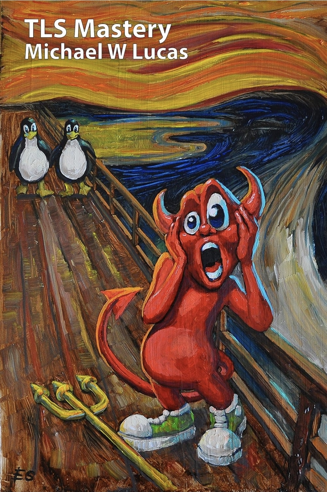

# TLS Mastery

**Author:** Michael W. Lucas

  

---
## Overview

This book provided foundational knowledge into Transport Layer Security (TLS), encryption in transit, certificate-based trust, certificate authorities, and Public Key Infrastructure (PKI). 

### My Review

I've said it before and I will say it again, Michael W. Lucas’ writing style makes learning complex technical concepts significantly more approachable.
He has a way of explaining deeply technical subjects without making them feel overly academic or difficult to follow, and the fact that he has managed to accomplish this for PKI is extraordinary.. The humour, real-world examples, and frequent footnotes made the book feel engaging throughout 
while still delivering a high level of technical depth. 

His writing style is the reason I continue returning to his books as learning resources throughout my cybersecurity and homelab projects. 

---
## Key Concepts Applied

- Public/private key cryptography
- Certificate Authorities (CA)
- Root and Intermediate certificate hierarchies
- TLS certificate trust chains
- HTTPS implementation
- Certificate revocation concepts
- Certificate signing requests (CSR)
- NGINX TLS configuration
- Encryption in transit

---
## Related Projects

[Internal PKI with NGINX](../../projects/secure/internal-pki/README.md)

---
## Practical Application

Knowledge gained throughout this book was directly applied within the homelab environment to build and manage an internal single-tier PKI architecture. 
This included configuring a Root CA, issuing certificates, deploying HTTPS through NGINX, validating certificate trust chains, 
implementing certificate revocation lists (CRLs), and securing internal web services using TLS encryption.

---
